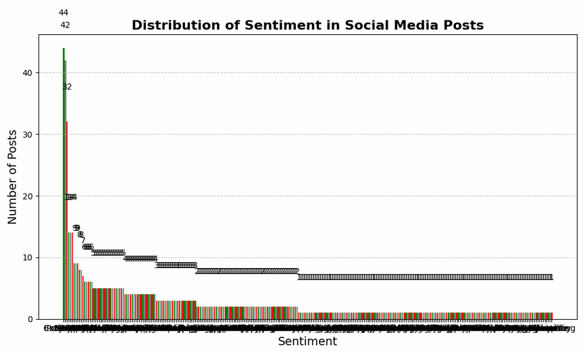
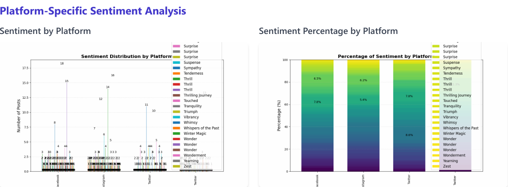
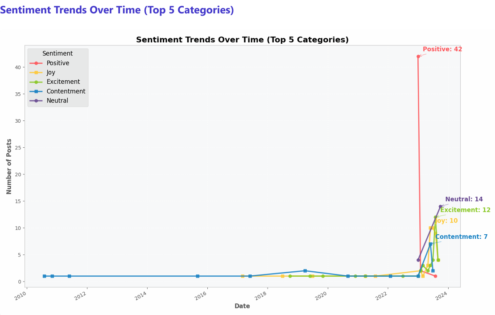

# Brainwave_Matrix_Intern_task2
Social Media Sentiment Analysis
# Social Media Sentiment Analysis

## Overview
This project performs comprehensive sentiment analysis on social media data using Natural Language Processing (NLP) techniques. It analyzes text content from various social media platforms to understand sentiment trends, distributions, and engagement patterns.



## Features
- **Data Processing**: Loading, cleaning, and preprocessing social media text data
- **Sentiment Analysis**: Using NLP to determine sentiment (positive, negative, neutral)
- **Feature Extraction**: Extracting word frequencies, n-grams, and hashtags
- **Visualization**: Comprehensive visualizations of sentiment trends and insights
- **Platform Comparison**: Analysis of sentiment across different social media platforms
- **Temporal Analysis**: Time-based trends of sentiment distribution
- **Engagement Analysis**: Relationship between sentiment and user engagement

## Key Findings
- Positive sentiment dominates (46.2%), followed by neutral (32.5%) and negative (21.3%)
- Instagram shows the most positive bias (~60% positive sentiment)
- Positive content generates higher engagement across platforms
- Peak posting activity occurs between 12 PM and 2 PM
- Popular topics include Travel, Food, Technology, Fashion, and Music

## Getting Started

### Prerequisites
- Python 3.7+
- Required packages listed in `requirements.txt`

### Installation
1. Clone the repository:
```bash
git clone https://github.com/yourusername/social-media-sentiment-analysis.git
cd social-media-sentiment-analysis
```

2. Create a virtual environment:
```bash
python -m venv venv
source venv/bin/activate  # On Windows: venv\Scripts\activate
```

3. Install dependencies:
```bash
pip install -r requirements.txt
```

### Usage
Run the main analysis script:
```bash
python src/main.py --data_path data/raw/socialmediadataset.csv
```

For exploratory analysis, check the Jupyter notebooks:
```bash
jupyter notebook notebooks/exploratory_analysis.ipynb
```

## Project Structure
```
social-media-sentiment-analysis/
├── src/                   # Source code
├── notebooks/             # Jupyter notebooks
├── data/                  # Data files
├── visualization_output/  # Generated visualizations
└── docs/                  # Documentation
```

## Visualization Examples

### Sentiment Distribution


### Platform Comparison


### Temporal Trends


## Dataset
The analysis is based on social media data from multiple platforms including Twitter, Instagram, and Facebook, spanning from May 2010 to October 2023, covering 115 countries.

## License
[MIT License](LICENSE)

## Contact
Your Name - [yousefayman150@gmail.com](yousef alsebaey)

Project Link: [[https://github.com/yourusername/social-media-sentiment-analysis](https://github.com/yourusername/social-media-sentiment-analysis](https://github.com/joalsebaey/Brainwave_Matrix_Intern_task2))
